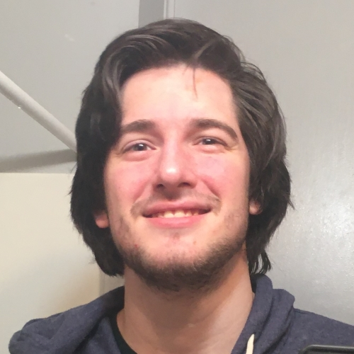

# Michael Burnes
## Current:
I am a senior in my last semester for my B.S. in Computer Science. I am the Makerspace Manager, as well as a TA for Network Fundamentals. 
## Background:
I'm from and (for the time being) permanently live in St. Louis, Missouri. It's a bout a 5:30 drive from Maryville. I transferred from the University of Missouri - St. Louis, and to there I transferred from Missouri University of Science and Technology in Rolla, Missouri. This is my third university. I'm an avid computer enthusiast, gamer, and musician. 
## Plans:
I plan on going somewhere (anywhere in the USA, really) in the IT or Software Engineering field. I hope to be a part of something that's more hands-on than sitting around coding all day.

## Links:
Check me out on my platforms:

https://github.com/mtburnes

https://linkedin.com/in/mtburnes

